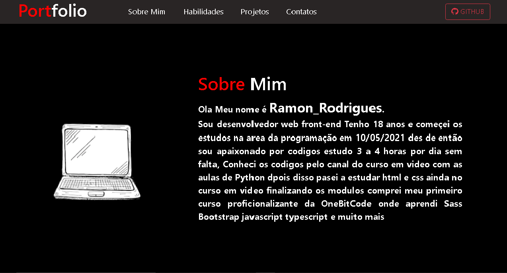

# Portifolio
Portifólio Em desenvolvimeto.

<h3>Oi!, como você esta?? espero que esteja bem.  
Este é meu portfôlio pessoal nele você me conhecera melhor, e vera meus melhores projetos.</h3>

<ul>
  <h3>Informação</h3>
  <li>Projeto desenvolvido em HTML | CSS | JavaScript | Sass e Bootstrap</li>
  <li>Layout Responsivo</li>
  <li>HTML5 semantico otomizado para mecanismo de busca</li>
  <li>Biblioteca de animação de texto</li>
</ul>

<ul>
  <h3>Links</h3>
  <li><a href="https://ramon-rodrigues-001.github.io/Portifolio/" target="_blank">Ver Site Hospedado "Deploy"</a></li>
  <li><a href="https://michalsnik.github.io/aos/" target="_blank">Biblioteca de animação de texto </a></li>
</ul>

