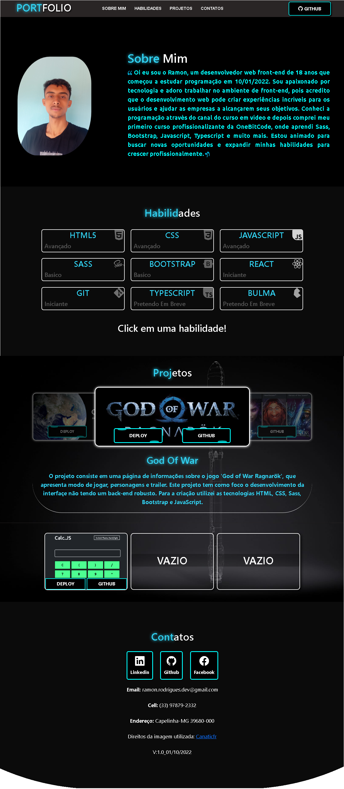

# Portfólio

<h3>Oi!, como você esta? Espero que esteja bem.  
Este é meu portfólio pessoal, nele você me conhecera melhor, e vera meus melhores projetos.</h3>

  <ul>
    <h3>Informação</h3>
    <li>Projeto desenvolvido em HTML | CSS | JavaScript | Sass e Bootstrap</li>
    <li>HTML5 semântico otimizado para mecanismo de busca</li>
    <li>Biblioteca de animação de texto com AOS Animation</li>
    <li>Biblioteca de animação de cards com vanilla-tilt-js</li>
    <li>Layout Responsivo</li>
  </ul>

  <ul>
    <h3>Links</h3>
    <li><a href="https://ramon-rodrigues-001.github.io/Portifolio/" target="_blank">Ver Site Hospedado "Deploy"</a></li>
    <li><a href="https://michalsnik.github.io/aos/" target="_blank">Biblioteca de animação de texto: AOS Animation</a></li>
    <li><a href="https://micku7zu.github.io/vanilla-tilt.js/" target="_blank">Biblioteca de animação de cards: Vanilla-tilt-js</a></li>
  </ul>

